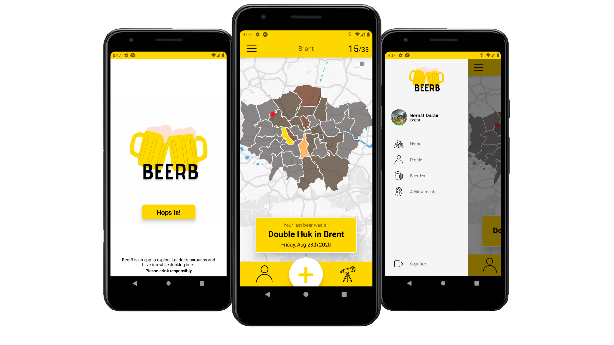
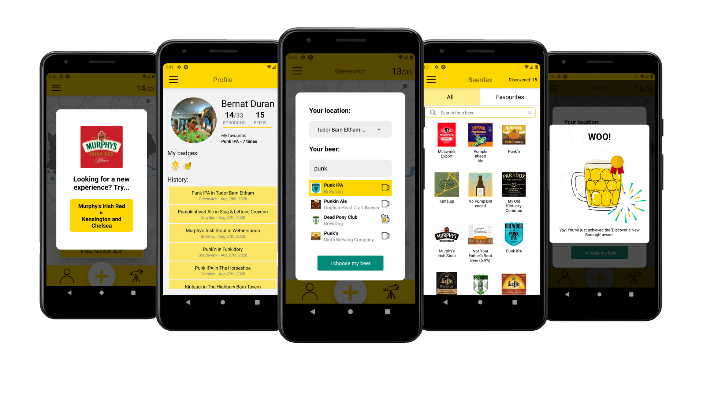

# BeerB - BeerB in every Borough

<!-- ALL-CONTRIBUTORS-BADGE:START - Do not remove or modify this section -->

<!-- ALL-CONTRIBUTORS-BADGE:END -->

> Frontend client files for the BeerB app.

  

 

BeerB is an app that encourages you to explore London boroughs, try different beers and keep track of your adventures!
It started with an idea of a scratch map and evolved into a good looking, smooth running and fun app.
BeerB is made with React Native(Expo) for Android users with the help of the amazing Untappd API and Google Places API.

 

Once you're logged in (through Facebook or creating a profile), start logging beers and pubs to start scratching off your map - the more you discover the 'lager-er' the map! You can favorite beers, see their description and invite friends to join you. There are badges to unlock by visiting new boroughs and drinking different beers as well as a beerdex that contains a database of multiple beers for you to explore. If you don't know where to go or what to drink, try the discovery button that will give you a suggestion - and you could always ask for a new one with just one swipe!

 

## TLDR:

Checkout a video demo of the app on [YouTube](https://www.youtube.com/watch?v=wZ4gDSbOGk4):

## Table of contents

[BeerB backend](https://github.com/maylynn-ng/beerbServer)  
[Tech Stack](#tech-stack)  
[Running BeerB](#running-beerb)  
[Observations](#observations)  
[Developers Team](#developers-team)  
[Contributors](#contributors)

## Tech Stack

:beer: [React Native](https://reactnative.dev/)  
:beer: [Typescript](https://www.typescriptlang.org/)  
:beer: [Expo](https://expo.io/)  
:beer: [Redux](https://redux.js.org/)  
:beer: [Auth0](https://auth0.com/)  
:beer: [Express](https://expressjs.com/)  
:beer: [PostgreSQL](https://www.postgresql.org/)  
:beer: [Sequelize](https://sequelize.org/)  
:beer: [Heroku](https://www.heroku.com/)  
:beer: [Lottie](https://airbnb.io/lottie/#/)  
:beer: [Untappd API](https://untappd.com/home)  
:beer: [Google Places API](https://cloud.google.com/maps-platform/places)

## Running BeerB

- Fork & clone this repo  
  Run `npm i` in beerb directory  
  Adjust the necessary env variables to match your system. There's a .env.copy file to help you with this process.  
  (You will need an API key for the untappd and google places APIs)  
  Run `expo start`

- Fork & clone the [server repo](https://github.com/maylynn-ng/beerbServer)  
  Make sure you have postgreSQL installed on your machine [mac](https://www.postgresql.org/download/macosx/) || [windows](https://www.postgresql.org/download/windows/)  
  Run `npm i` in beerbServer directory  
  Adjust the necessary env variables to match your system. There's a .env.copy file to help you with this process.
  Edit the ./config/config.json file with your database details.
  With the database running, run `npm run recreateDb`. This will generate the tables in the database and seed the data to get the project started.
  Run `npm start` in beerbServer directory

Android Simulator:

- Download an android simulator (like [this one](https://developer.android.com/studio))
- Run `a` into the CLI

On your android device

- Install '[Expo Client](https://play.google.com/store/apps/details?id=host.exp.exponent&hl=en_GB)' from the google playstore
- Open expo on your phone
- Scan the QR code in the CLI

:beers: Let it bundle & start exploring! :beers:

## Observations

##### Room for improvements

- Better typing for TypeScript
- Expo is causing us some problems due to the multiple environments. Explore other options that better match our needs
- Write tests
- Explore using a more global styling method

##### Next orders

- Deploy BeerB to the play store
- Add connecting to friends
- Add new cities
- Add more badges
- Create affiliations with pubs
- Make it friends with iOS

## Developers Team

😬 Bernat Duran Pons - [Github](https://github.com/Ishdril) - [LinkedIn](https://www.linkedin.com/in/bernat-duran)  
😬 Marijana Del Bianco - [Github](https://github.com/mjdelbianco) - [LinkedIn](https://www.linkedin.com/in/mjdelbianco/)  
😬 Maylynn Ng - [Github](https://github.com/maylynn-ng) - [LinkedIn](https://www.linkedin.com/in/maylynn-ng/)

## Contributors ✨

Thanks goes to these wonderful people ([emoji key](https://allcontributors.org/docs/en/emoji-key)):

<!-- ALL-CONTRIBUTORS-LIST:START - Do not remove or modify this section -->
<!-- prettier-ignore-start -->
<!-- markdownlint-disable -->
<table>
  <tr>
    <td align="center"><a href="http://www.linkedin.com/in/bernat-duran"> <b>Bernat Duran</b></a> <a href="#infra-Ishdril" title="Infrastructure (Hosting, Build-Tools, etc)">🚇</a> <a href="https://github.com/maylynn-ng/beerb/commits?author=Ishdril" title="Code">💻</a></td>
    <td align="center"><a href="http://mjdelbianco.github.io"> <b>Marijana Del Bianco</b></a> <a href="#infra-mjdelbianco" title="Infrastructure (Hosting, Build-Tools, etc)">🚇</a> <a href="https://github.com/maylynn-ng/beerb/commits?author=mjdelbianco" title="Code">💻</a></td>
    <td align="center"><a href="https://www.linkedin.com/in/maylynn-ng/"> <b>Maylynn</b></a> <a href="#infra-maylynn-ng" title="Infrastructure (Hosting, Build-Tools, etc)">🚇</a> <a href="https://github.com/maylynn-ng/beerb/commits?author=maylynn-ng" title="Code">💻</a></td>
  </tr>
</table>

<!-- markdownlint-enable -->
<!-- prettier-ignore-end -->
<!-- ALL-CONTRIBUTORS-LIST:END -->

This project follows the [all-contributors](https://github.com/all-contributors/all-contributors) specification. Contributions of any kind welcome!

